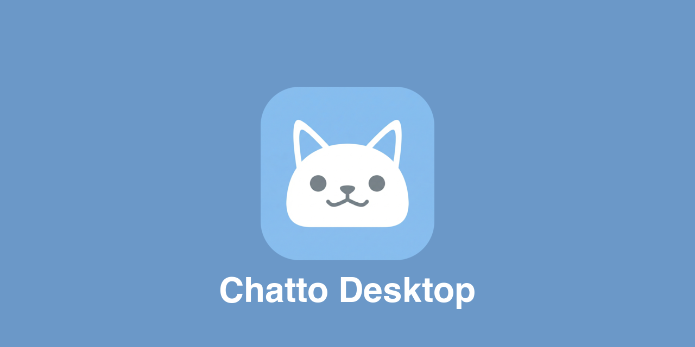

# Chatto Desktop

<p align="center">
  
</p>

Native desktop wrapper for [Chatto](https://chatto.run) built with [Tauri v2](https://v2.tauri.app/).

Loads your Chatto instance in a native webview with system tray integration, native notifications, auto-start, and deep link support.

## Features

- **System tray** — show/hide window, quick access to settings, autostart toggle
- **Native notifications** — bridges the web Notification API to OS-native notifications
- **Auto-start** — optionally launch at login
- **Deep links** — `chatto://` protocol handler
- **Window title tracking** — reflects the current instance, space, and channel
- **Window state persistence** — remembers size and position across restarts

## Development

### Prerequisites

- [mise](https://mise.jdx.dev/) for toolchain management (installs Node, Rust, pnpm)
- macOS, Linux, or Windows with [Tauri v2 prerequisites](https://v2.tauri.app/start/prerequisites/)

### Setup

```sh
mise install        # install pinned Node, Rust, pnpm
pnpm install        # install frontend dependencies
pnpm tauri dev      # launch in dev mode
```

### Build

```sh
pnpm tauri build    # produces .app, .dmg (macOS), .msi (Windows), .deb/.AppImage (Linux)
```

## License

[AGPL-3.0-or-later](LICENSE)
